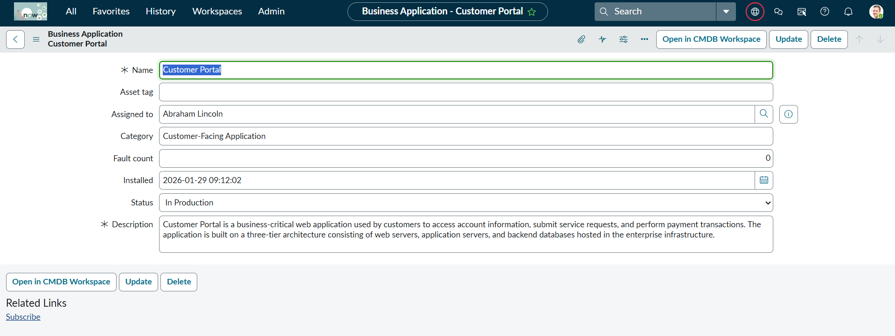
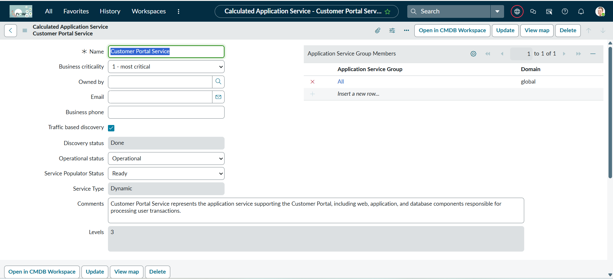
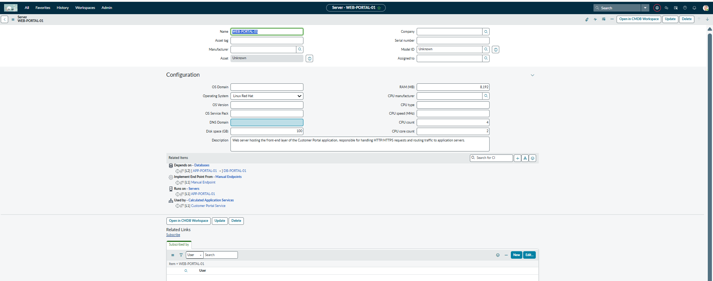
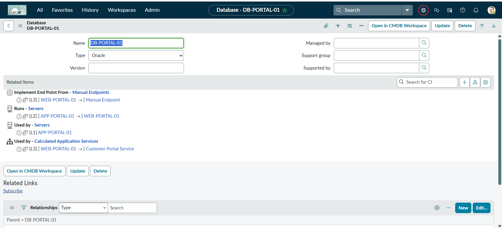
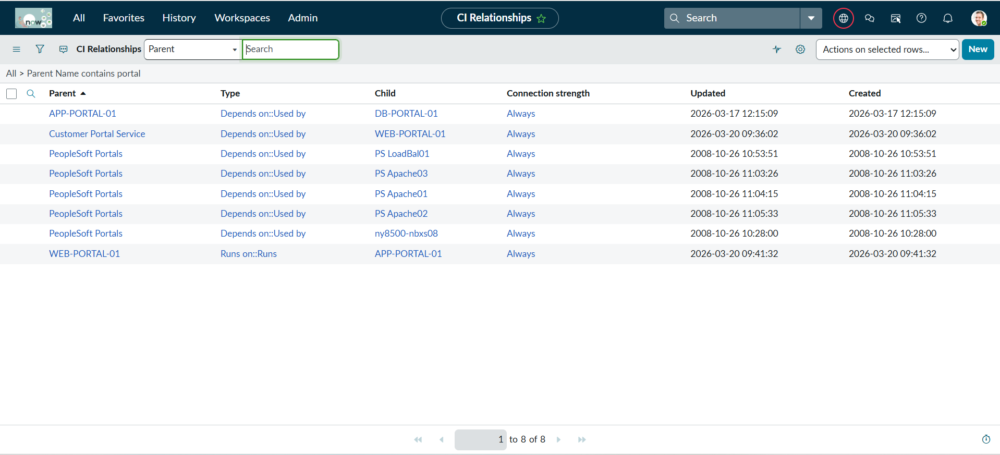
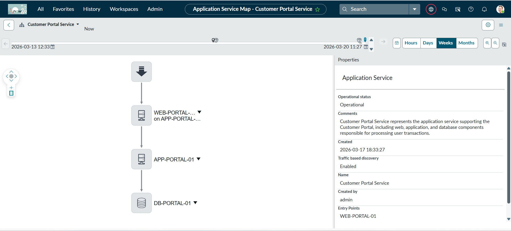
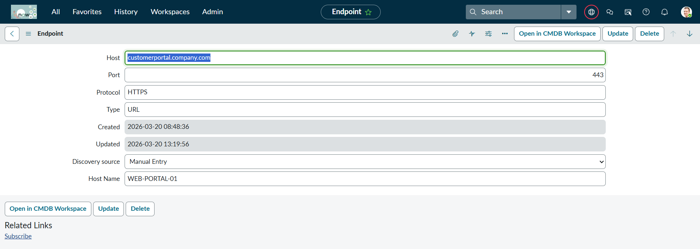
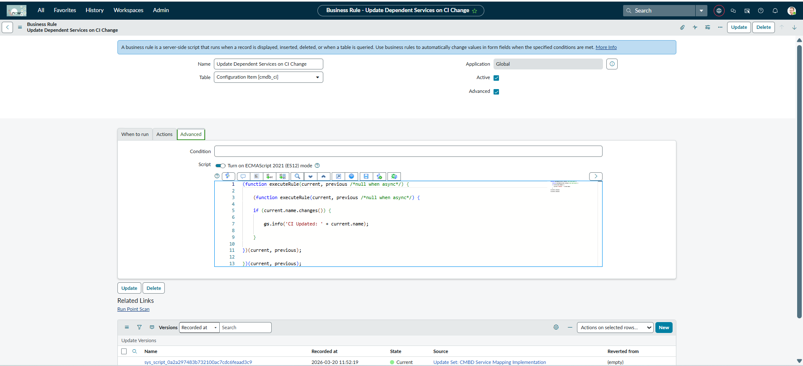
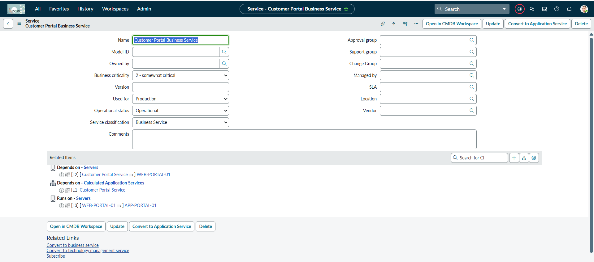

# ServiceNow Enterprise CMDB & Service Mapping Implementation

Designed and implemented a CSDM-aligned CMDB solution in ServiceNow to model a customer-facing application, supporting infrastructure, and service dependencies.

## Overview

This project demonstrates how ServiceNow CMDB can be used to represent business applications, application services, infrastructure components, and service relationships in a structured and realistic way.

The implementation focuses on visibility, service dependency mapping, and impact analysis for a customer-facing portal application.

## Business Scenario

A customer-facing application lacked visibility into how web, application, and database layers were connected. During incidents, support teams had difficulty identifying which infrastructure components supported the affected service.

To improve operational visibility, a CMDB and Service Mapping solution was implemented to model the service architecture and supporting configuration items.

## Objectives

- Build a structured CMDB aligned with CSDM concepts
- Create Business Application, Business Service, and Application Service records
- Model infrastructure components in CMDB
- Establish CI relationships across service and infrastructure layers
- Visualize dependencies through Service Mapping
- Simulate discovery outputs using manually created CIs and endpoints
- Add automation through Business Rules

## Architecture Flow

Customer Portal (Business Application)  
↓  
Customer Portal Business Service  
↓  
Customer Portal Service (Application Service)  
↓  
WEB-PORTAL-01  
↓  
APP-PORTAL-01  
↓  
DB-PORTAL-01  

## Key Features

- Business Application modeling
- Business Service and Application Service hierarchy
- CI relationship mapping
- Service Mapping topology visualization
- Endpoint configuration
- Discovery simulation through manual CI creation
- Business Rule automation on CMDB updates

## Modules and Capabilities Used

**Vendor:** ServiceNow

**Tools and capabilities used in this project:**

- **CMDB** — used to create and manage Business Application, Business Service, Application Service, Server, and Database records for the Customer Portal architecture.
- **CSDM-aligned modeling** — used to organize the business and technical service layers in a structured way by connecting Business Service, Application Service, and infrastructure CIs.
- **Service Mapping** — used to visualize the end-to-end flow between the application service and supporting infrastructure components.
- **CI Relationships** — used to establish dependency paths between service and infrastructure records for impact visibility.
- **Business Rules** — used to automate CI update tracking and demonstrate platform automation capabilities.
- **Discovery simulation** — represented by manually creating infrastructure CIs, endpoints, and relationship data to reflect how Discovery-driven CMDB population would appear in a controlled environment.

## Implementation Details

### 1. Business Application
Created the **Customer Portal** as the top-level business application representing a customer-facing digital platform.

### 2. Business Service
Created **Customer Portal Business Service** to represent the business-facing service layer aligned with CSDM concepts.

### 3. Application Service
Created **Customer Portal Service** as the calculated application service responsible for the web, application, and database flow supporting the portal.

### 4. Infrastructure CIs
Created supporting infrastructure records:
- **WEB-PORTAL-01**
- **APP-PORTAL-01**
- **DB-PORTAL-01**

### 5. CI Relationships
Established dependency relationships across the environment:
- Customer Portal Service → WEB-PORTAL-01
- WEB-PORTAL-01 → APP-PORTAL-01
- APP-PORTAL-01 → DB-PORTAL-01

### 6. Service Map
Generated and validated the application service map to visualize the end-to-end infrastructure path supporting the customer portal.

### 7. Endpoint Configuration
Created an endpoint record for:
- Host: `customerportal.company.com`
- Protocol: `HTTPS`
- Port: `443`

Linked the endpoint to the web server to represent the service entry point.

### 8. Automation
Created a Business Rule on `cmdb_ci` to log CI updates and demonstrate automation within CMDB administration.

## Real-World Value

This implementation demonstrates how ServiceNow can be used to:

- improve service visibility
- support dependency-based impact analysis
- model application architecture in CMDB
- strengthen operational troubleshooting
- align technical records with business-facing services

## Screenshots

### Business Application

### Application Service

### Web Server

### Database

### CI Relationships

### Service Map

### Endpoint

### Business Rule

### Business Service

## What I Learned

- How to structure CMDB records using CSDM-aligned layers
- How application services depend on infrastructure CIs
- How CI relationships support impact analysis
- How Service Mapping improves service visibility
- How automation can support CMDB data management

## Conclusion

This project reflects a practical ServiceNow CMDB and Service Mapping implementation focused on architecture visibility, service dependency modeling, and operational support readiness.
